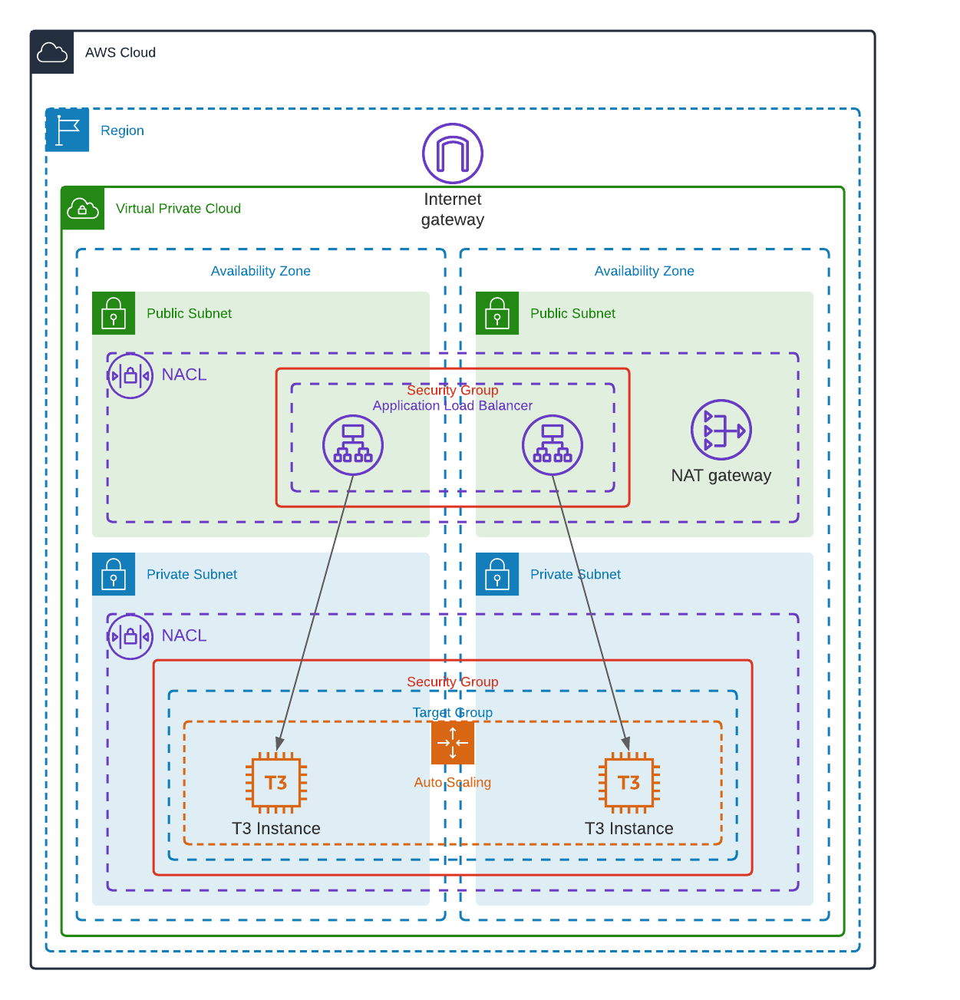

## Raw Cloudformation

### Brief

I used Cloudformation resource [AWS Document](https://docs.aws.amazon.com/AWSCloudFormation/latest/UserGuide/template-reference.html) to creat a private network match the supplied [architecture](architecture.task1.png).

The architecture comprises of the following:
* A VPC spread across 2 AZs with a Internet Gateway
* 2 public and 2 private subnets across the 2 AZs with Network ACLs (NACL) controlling ingress and egress traffic to the VPC 
* A single NAT Gateway in one of the public subnets to allow outbound internet access from the private subnets along with route tables to support this.
* A multi-az public Application Load Balancer (ALB) with 2 private EC2 targets running Nginx.
* The environment shouldn't be open to the world and only accessible through the load balancer.

### Tips

* The following tools will help identify issues with the template and environment.
    * [cfn-nag](https://github.com/stelligent/cfn_nag)
    * [cfn-lint](https://github.com/aws-cloudformation/cfn-lint)
    * [session manager](https://docs.aws.amazon.com/systems-manager/latest/userguide/session-manager-working-with-sessions-start.html#sessions-start-cli)
* Cloudformation [intrinsic functions](https://docs.aws.amazon.com/AWSCloudFormation/latest/UserGuide/intrinsic-function-reference.html) helps to calculate subnet CIDRs and availability zones.
### Objective 

After project completion, I created a cloudformation stack from the template, and browse the default Nginx page using the DNS record for the application load balancer